# How to integrate OCI Resource Manager with Automation Process

## Introduction

The Resource Manager service automates the deployment and operations of all Oracle Cloud Infrastructure resources. Using the infrastructure-as-code (IaC) model, the service is based on Terraform, an open source industry standard that allows DevOps engineers to develop and deploy their infrastructure anywhere.

A Terraform configuration encodes your infrastructure in declarative configuration files. The Resource Manager service allows you to share and manage infrastructure configurations and state files across multiple teams and platforms.

Through the OCI Resource Manager it is possible to execute Terraform scripts in the Oracle Cloud console, but it is also possible to make a REST call or through the OCI CLI, thus expanding the possibilities of integration with automation tools such as OCI Devops, Jenkins, github, among others.

Here I will show how to automate the deployment of an Oracle Cloud Autonomous Database instance by obtaining the database admin password securely through Oracle Cloud Vault Secrets without exposing it in the files and so that the Oracle Cloud Resource execution user Manager has proper access to create the database and stored password.

## Objectives

The objective of this material is to allow the configuration of automation through Terraform so that you can create instances with their appropriate access credentials but without exposing any sensitive information. Information such as password must be stored so that only authorized users can use it within the Terraform script.
The Terraform script will be executed through the OCI Resource Manager and the user must have permissions to:

- Create resources in the compartment
- Create an Autonomous Database instance
- Read an OCI Vault password
- Terraform script execution

## Pre Requirements

- Have an user inside an user group without any Policy. This user will be given the appropriate permissions to run Terraform in OCI Resource Manager
- An **OCI Object Storage** bucket created previously in a specific compartment (if you want to generate the **Terraform** script into this bucket)

## Task - Create a Secret for Autonomous Database in OCI Vault

We will create a password in **OCI Vault / Secret** to illustrate how to configure a new resource in **Terraform** without expose a sensitive data.

**OCI Vault / Secrets** are credentials such as passwords, certificates, SSH keys, or authentication tokens that you use with Oracle Cloud Infrastructure services. Storing secrets in a vault provides greater security than you might achieve storing them elsewhere, such as in code or configuration files. You can retrieve secrets from the Vault service when you need them to access resources or other services.
You can create secrets by using the Console, CLI, or API. Secret contents for a secret are imported to the service from an external source. The Vault service stores secrets in vaults.

>**Note:** For this step, we need to log in with an Admin user in OCI. You must have permission to create a password in OCI Vault

Go to me Main menu and select **Identity & Security** and **Vault**

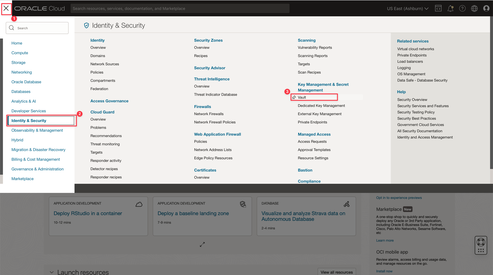

Select the compartment you want to store the secrets and click on **Create Vault** button

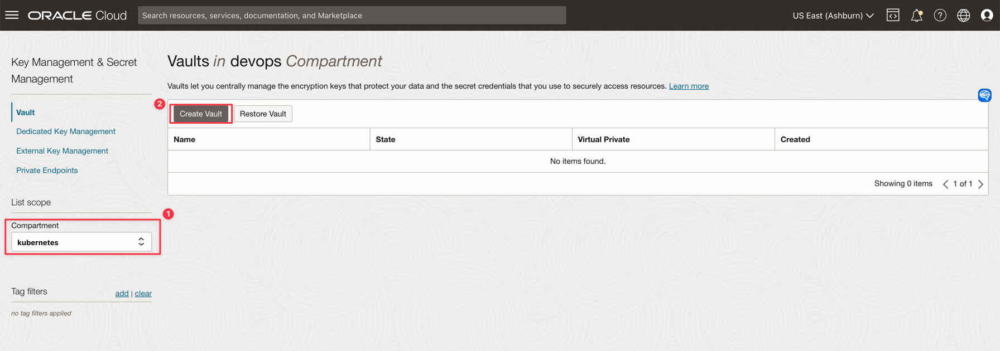

Put a name for your vault, confirm the compartment and click on **Create Vault** button

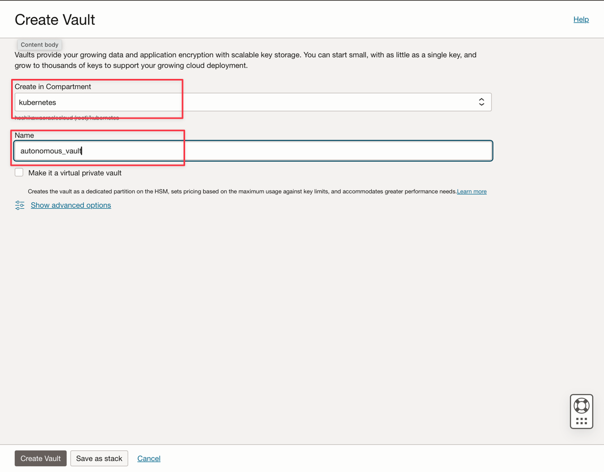
Confirm the vault creation and let's create a key. Click on **Create Key** button

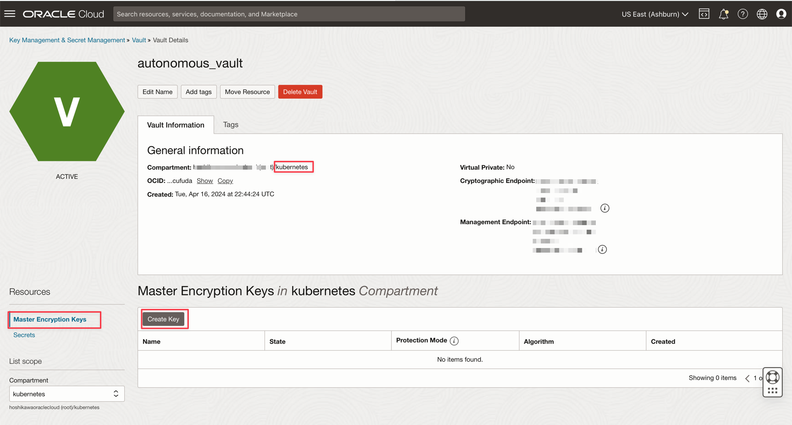

Confirm the compartment and put a name for your key. For example, put **autonomouskey** on Name and click on **Create Key** button

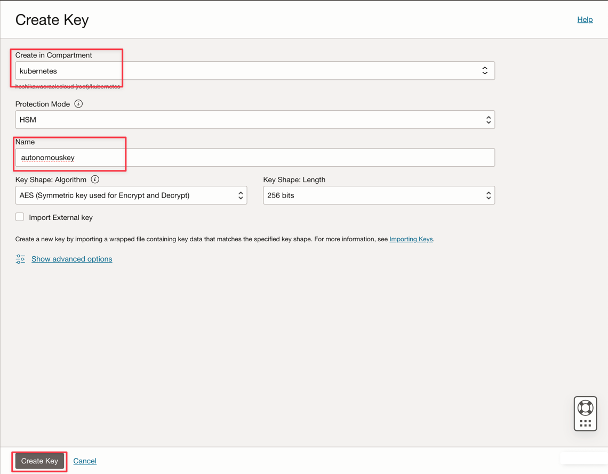
Confirm the key creation

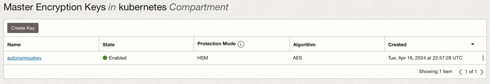
Now, click on **Secrets** option and click on **Create Secret** button

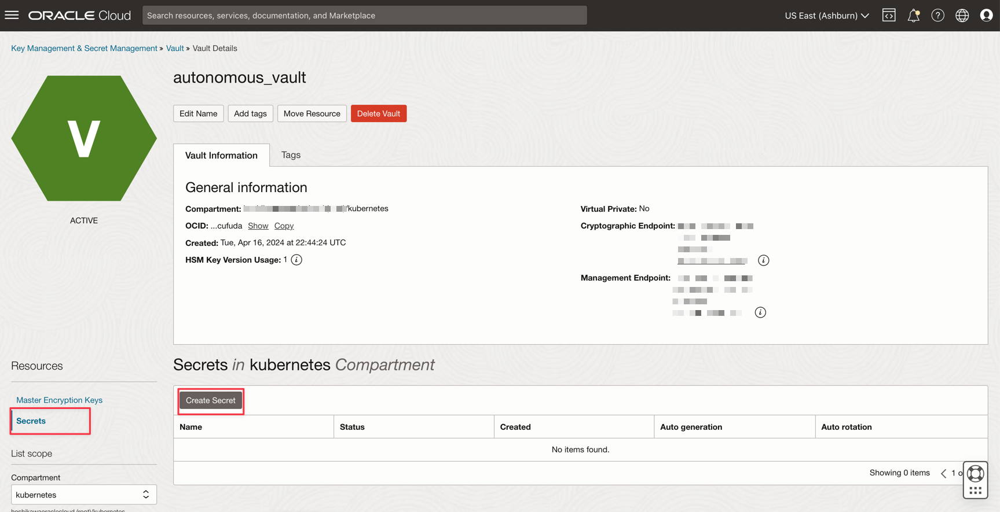

We will create the **Autonomous Admin** password. Confirm the compartment, put a name for your first secret. Select **Manual secret generation** to include the password. Select **Plain-Text** option on **Secret Type Template** and write your password. Finally, click on **Create Secret** button.

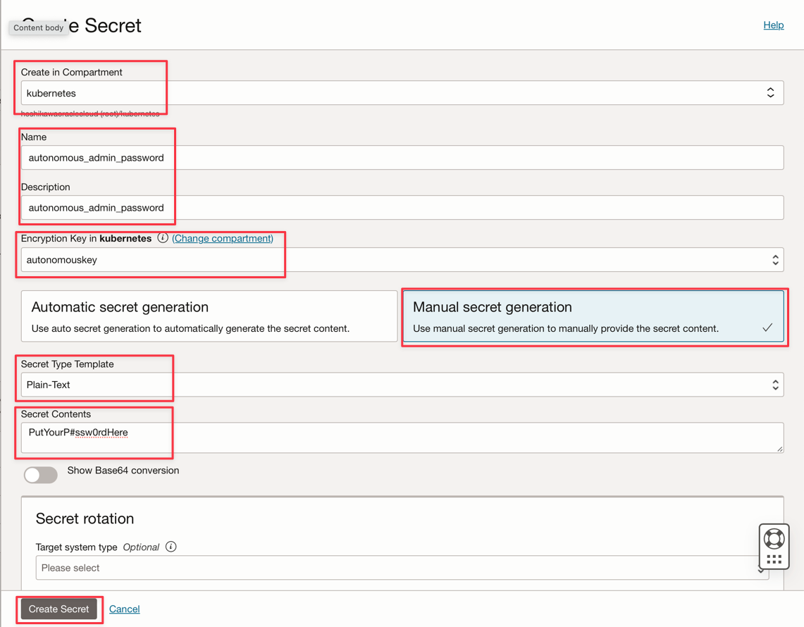

## Task - Create Policies to the OCI user

>**Note:** For this step, we need to log in with an Admin user in OCI.

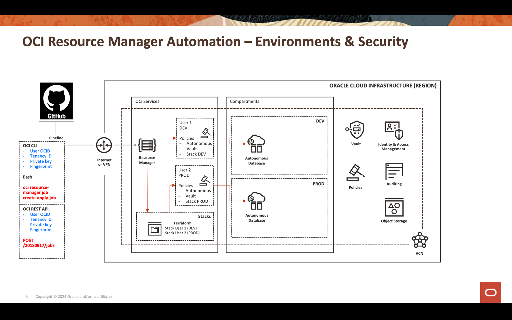

    This policy gives the permission to group TestGroup created previously to manage a Stack and jobs in Resource Manager
    - Allow group 'Default'/'TestGroup' to manage orm-stacks in compartment integration
    - Allow group 'Default'/'TestGroup' to manage orm-jobs in compartment integration
    - Allow group 'Default'/'TestGroup' to read orm-config-source-providers in tenancy

    This policy gives the right to create an Autonomous Database instance in the compartment integration
    - Allow group 'Default'/'TestGroup' to manage autonomous-database in compartment integration

    The group can read the password stored in Vault/Secret through Terraform scripts 
    - Allow group 'Default'/'TestGroup' to use secret-family in tenancy

    This policy gives the right to save the Terraform scripts on a specific compartment
    - Allow group 'Default'/'TestGroup' to manage all-resources in compartment kubernetes

## Task - Create a Stack from a Template

Let's create a stack for an Autonomous Database instance. We can use a template for this.
The first step is log in as the user created previously.

Now, select the Main Menu

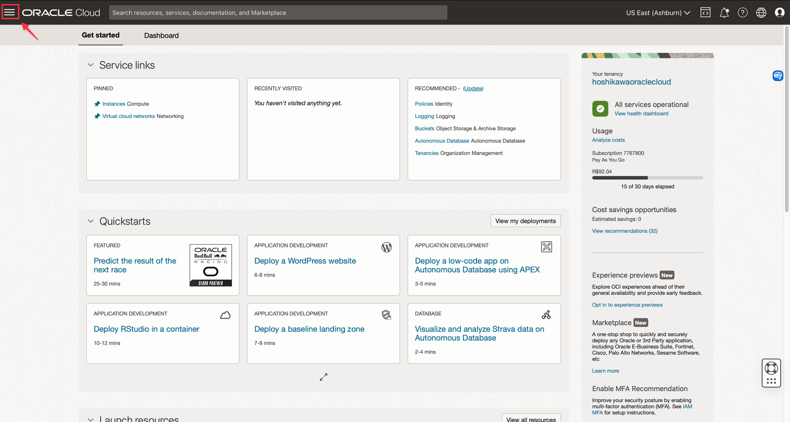

And go to **Developer Services** and **Resource Manager** / **Stacks**

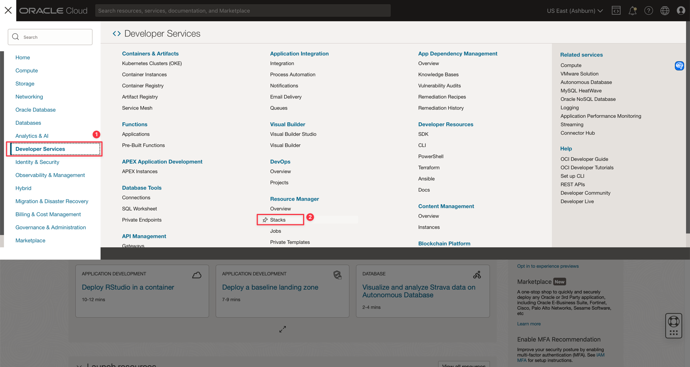

Select your **compartment** and click on **Create stack** button

Now select **Template** option and click on **Select template** button to choose to generate a **Terraform** script for the the **Autonomous Database** 

In **Service** tab, find the **Autonomous Transaction Processing Database** option and click to mark this option and then click on **Select template** button 

You can generate the **Terraform** scripts and store into a **OCI Object Storage** bucket.
Select **Use custom Terraform providers**, then choose the bucket **compartment** and **name**.
Save your **stack**

You stack is saved 

This template does not read the secret stored in your **OCI Vault**. To make the **Terraform** to read the **secret**, we need to change the code.

Click on **Edit** select box and choose the **Edit Terraform configuration in code editor** option.

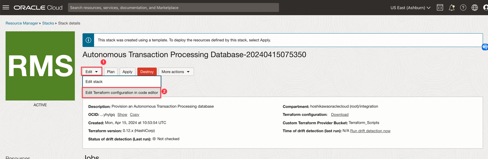

You can now edit the code. The default code generates a random string for the password

**Figure 1 - main.tf** file

**Figure 2 - main.tf** file

You need to add a new data named **oci_secrets_secretbundle** and assign it to the attributes:

- **admin_password** at autonomous_data_warehouse and autonomous_database positions
- **password** at autonomous_database_wallet position

**Figure 3 - main.tf / autonomous_data_warehouse positon**

**Figure 4 - main.tf / autonomous_database position**  
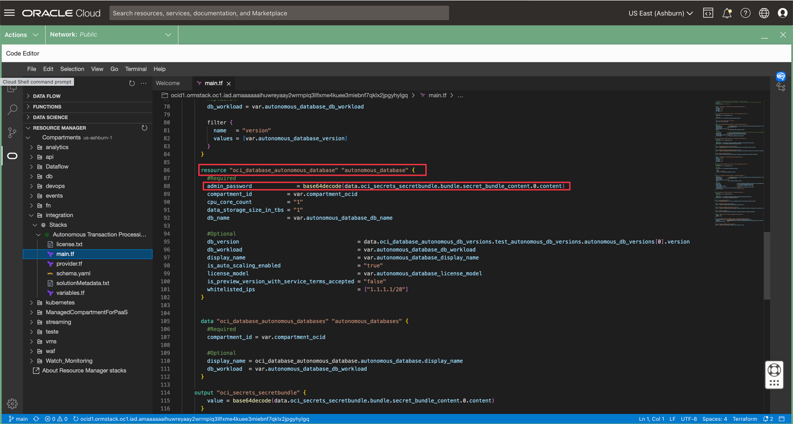

**Figure 5 - main.tf / autonomous_database_wallet position**
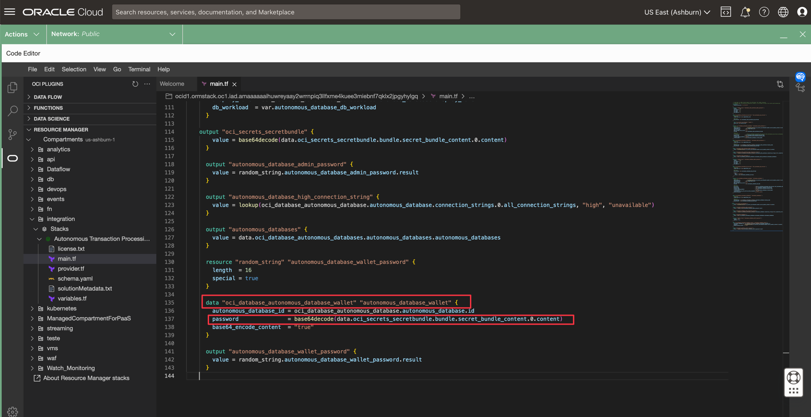

Include this code into **variables.tf** file and replace the **OCID** for your secret generated previously

      variable "secret_ocid" {
        default = "ocid1.vaultsecret.oc1.iad.xxxxxxxxxxxxxxxxxxxxxxxxxxxxxxxxxxxxxxxxxxxxxxxxxxxxxxx"
      }

**Figure 6 - variables.tf** file

## Task - Test permissions

You can test the **Policies** and see how you have control of **OCI Resource Manager**, **OCI Vault / Secret** and **Autonomous** instances in a specific **compartment**.

Let's do some tests. First, with your **Admin user**, log in into **OCI** and remove all the **Policies** for the group **TestGroup** in the **TestPolicy** Policy. Click on **Delete** button and confirm.

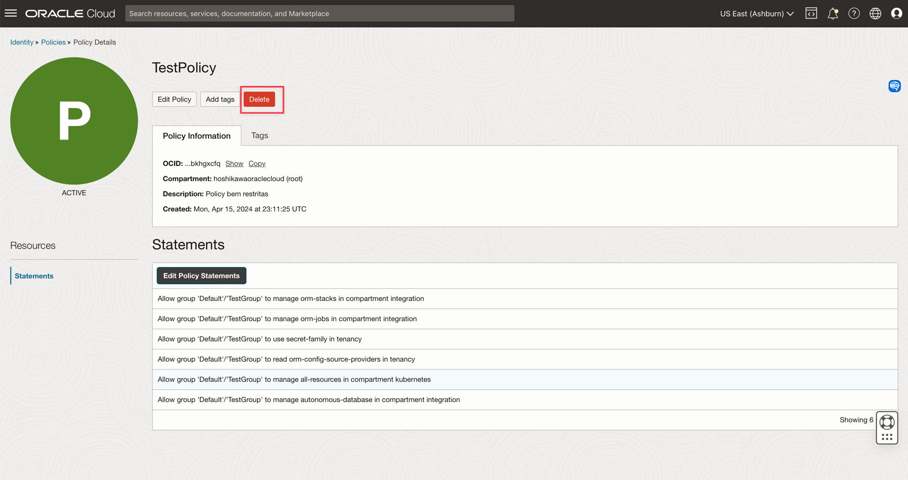

Now, log in with your **user** in the group **TestGroup** and you cannot see the stack, so you cannot execute it.

Now, with the **Admin user**, include this statement:

    Allow group 'Default'/'TestGroup' to manage orm-stacks in compartment integration
    Allow group 'Default'/'TestGroup' to manage orm-jobs in compartment integration
    Allow group 'Default'/'TestGroup' to read orm-config-source-providers in tenancy
    Allow group 'Default'/'TestGroup' to manage all-resources in compartment kubernetes

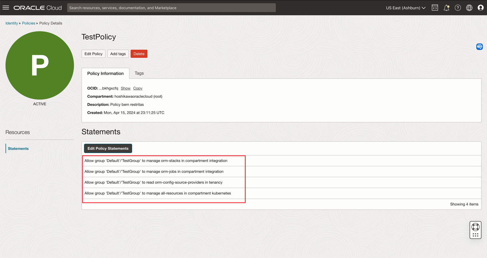

This statements grant your **user** in **TestGroup** to use the **OCI Resource Manager** stack.

We removed the grant for your **user** to create an **Autonomous** instance and read the **secret** in **OCI Vault**. So you can execute your **stack** but with no success. To test, click on **apply** button in your **stack** detail page.

Now, let's include **Autonomous** and **OCI Vault** permissions on the **TestPolicy**

    Allow group 'Default'/'TestGroup' to manage all-resources in compartment kubernetes
    Allow group 'Default'/'TestGroup' to manage autonomous-database in compartment integration

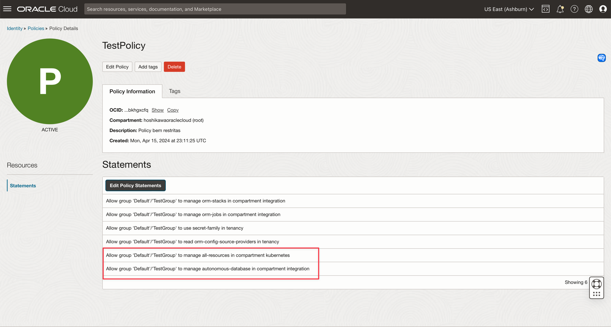

Click again on **apply** button in your **stack** detail page and you can see you have the control about all resources without exposing any password.

## Acknowledgments

- Author: Cristiano Hoshikawa (Oracle LAD A-Team Solution Engineer)

## References

- [Using OCI Vault Secrets for Terraform resources](https://blogs.oracle.com/developers/post/using-oci-vault-secrets-for-terraform-resources)
- [Securing Resource Manager](https://docs.oracle.com/en-us/iaas/Content/Security/Reference/resourcemanager_security.htm)
- [Overview of IAM](https://docs.oracle.com/en-us/iaas/Content/Identity/getstarted/identity-domains.htm#identity_documentation)
